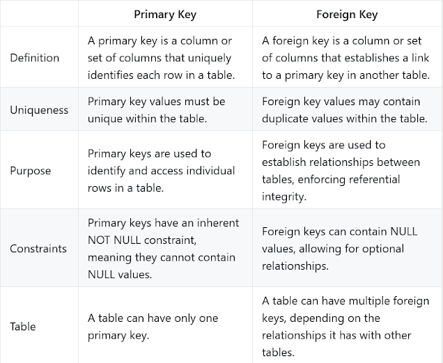

* A Foreign key is a column in one table which is the primary key on another table. 
* A foreign key and a Primary key are used to define the relationship between two tables in a relational database. 

For example in Employee and Department relationship, we have two tables: 

Department(dept_id, dept_name) and  
Employee (emp_id, emp_name, dept_id). 

dept_id is the primary key in the Department table and the foreign key in the Employee table.



* Name of foreign key can be different than the name of primary key it represent in other table. 
For example in our Employee and Department relationship, Primary key in Department table is dept_id  and 
we have used same name in Employee table to create foreign key. 
It could have been different e.g. departmentId or departmentID t etc.

* Table on which a column is declared as a primary key is known as parent table in the relationship and foreign key table is known as child table in a relationship. 
For example in Customer and ORDER relationship, Customer is parent table because cust_id is primary key there and ORDER is child table because cust_id is a foreign key in this table.

```
CREATE TABLE Customer (
cust_id INT NOT NULL, 
cust_name VARCHAR(256),                      
PRIMARY KEY (cust_id)
)

CREATE TABLE ORDER (
order_id INT NOT NULL,
amount INT NOT NULL,
cust_id INT,
FOREIGN KEY (cust_id) REFERENCES Customer(cust_id) ON DELETE CASCADE
) 
```

By using foreign key constraints, we can introduce referential integrity in multiple table relationship in SQL.
#Referential integrity guarantees data integrity

By using foreign key constraints, we can introduce referential integrity in multiple table relationship in SQL. 
Referential integrity guarantees data integrity, see benefits of Referential Integrity in SQL to know more.

* Referential Integrity is a set of constraints applied to foreign keys which prevents entering a row in the child table (where you have the foreign key) for which you don't have any corresponding row in the parent table i.e. entering NULL or invalid foreign keys. Referential Integrity prevents your table from having incorrect or incomplete relationships e.g. If you have two tables Order and Customer where Customer is parent table with primary key customer_id and Order is child table with foreign key customer_id. Since as per business rules you can not have an Order without a Customer and this business rule can be implemented using referential integrity in SQL on a relational database.

* Referential Integrity will cause failure on any INSERT or UPDATE SQL statement changing the value of customer_id in the child table If the value of customer_id is not present in the Customer table.

Referential Integrity example in MySQL tables
What is Refrential Integrity in SQL database with MySQL example
Another example of Referential Integrity is Employee and Department relationship. If we have dept_id as a foreign key in the Employee table then by using referential integrity constraints we can avoid creating  Employee without department or non-existing department.

In short Referential Integrity makes primary key foreign key relationships viable. Let's first create Employee and Department table with a primary key, foreign key, and referential integrity constraints.
```
CREATE TABLE Department (dept_id INT NOT NULL,
dept_name VARCHAR(256),                      
PRIMARY KEY (dept_id)) ENGINE=INNODB;

CREATE TABLE Employee (emp_id INT NOT NULL,
emp_name VARCHAR(256),
dept_id INT,
FOREIGN KEY (dept_id) REFERENCES Department(dept_id)
ON DELETE CASCADE) ENGINE=INNODB;
```
Above SQL statements will create both Department and Employee tables. dept_id is now a foreign key in the Employee table.

In this SQL, while creating a foreign key we have specified ON DELETE clause which tells, what needs to do when a record from the parent table is deleted. CASCADE referential action allows to delete or update all matching rows from the child table, after deleting a record in the parent table. This way Referential Integrity preserves data integrity of the relationship.

Let's see How Referential Integrity disallows INSERT and UPDATE for a record in the child table for which there is no matching record in the parent table. To check this Referential Integrity example execute the following MySQL queries :
```
INSERT INTO Department VALUES (1, "Sales");
INSERT INTO Employee VALUES (101, "Rajeev", 2)

mysql> INSERT INTO Employee VALUES (101, "Rajeev", 2)
-> ;
ERROR 1452 (23000): Cannot ADD OR UPDATE a child row: a FOREIGN KEY constraint fails (`test`.`employee`, CONSTRAINT `employee_ibfk_1` FOREIGN KEY (`dept_id`) REFERENCES `department` (`dept_id`) ON DELETE CASCADE)
```
When we inserted first record in Department table it ran fine but when we insert a record in Employee table with dept_id = 2 which is not present in Department i.e. parent table, failed to Referential integrity or foreign key constraint check.

If you modify your query and correct dept_id to 1, query will run fine, as shown below
```
mysql> INSERT INTO Employee VALUES (101, "Rajeev", 1);
Query OK, 1 row affected (0.05 sec)

Now let's delete our only record from Department table and see if matching records on child table is automatically deleted or not.

mysql> DELETE FROM Department;
Query OK, 1 row affected (0.05 sec)

mysql> SELECT * FROM Employee;
Empty SET (0.00 sec)
```

You see there is no record in the Employee table because of ON DELETE CASCADE, matching records in the child table are deleted. Similarly, you can use ON UPDATE CASCADE to automatically propagate UPDATE from the parent table to child tables.

Advantage of Referential Integrity in RDBMS and SQL
1) Referential Integrity prevents inserting records with incorrect details in table. Any insert or update operation will fail if it doesn't satisfy referential integrity rule.

2) If a records from parent table is deleted, referential integrity allows to delete all related records from child table using cascade-delete functionality.

3) Similar to second advantage if a record i.e. customer_id of a customer is updated on parent table (Customer table) , Referential Integrity helps to update customer_id in child table (Order) using cascade-update.

